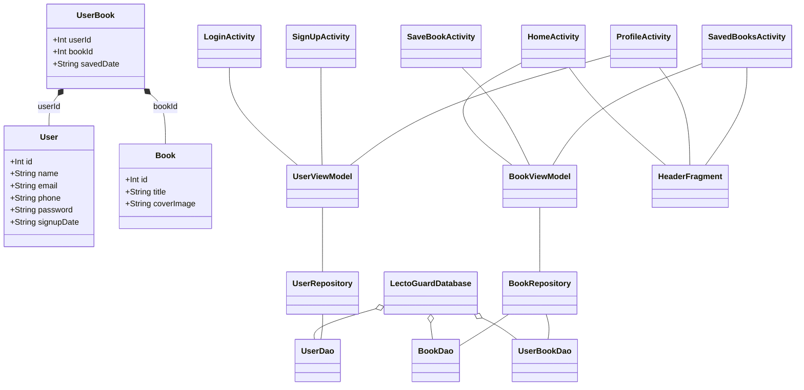

# Aplicación LectoGuard - Documentación

## Índice
- [Contexto de la Aplicación - Análisis](#contexto-de-la-aplicación---análisis)
- [Casos de Uso](#casos-de-uso)
- [Requisitos Funcionales y No Funcionales](#requisitos-funcionales-y-no-funcionales)
- [Diseño](#diseño)
- [Arquitectura](#arquitectura)
- [Base de datos](#base-de-datos)
- [Plan de Pruebas](#plan-de-pruebas)
- [Diagrama UML](#diagrama-uml)
- [Diagrama de Despliegue](#diagrama-de-despliegue)
- [Documentación Técnica del Desarrollo](#documentación-técnica-del-desarrollo)

---

## Contexto de la Aplicación - Análisis

### Mundo real del problema
La aplicación resuelve la necesidad de los amantes de la lectura de tener una app para descubrir, organizar y llevar un registro de los libros que quieren leer o han leído. Muchos lectores actualmente utilizan muchas plataformas sin un sistema unificado.

### Apps existentes similares
- Goodreads
- Wattpad
- Google Play Books
- Kindle

### Por qué mi app es mejor
- Interfaz simple y minimalista
- Enfoque en la experiencia básica de guardar libros sin distracciones
- Sistema de perfil personalizado con estadísticas sencillas
- No incluye publicidad
- Totalmente gratuita
- Funciona offline/online

---

## Casos de Uso

1. **Registro de nuevo usuario**
   - Actor: Usuario no registrado
   - Flujo: Completa formulario → validación de datos → se crea la cuenta

2. **Inicio de sesión**
   - Actor: Usuario registrado
   - Flujo: Introduce credenciales → se verifican → acceso concedido

3. **Exploración de libros**
   - Actor: Usuario autenticado
   - Flujo: Navega por lista → selecciona un libro → ve detalles

4. **Guardar libro**
   - Actor: Usuario autenticado
   - Flujo: Selecciona un libro → pulsa guardar → el libro se añade a su colección (sin duplicados)

5. **Visualización de perfil**
   - Actor: Usuario autenticado
   - Flujo: Accede a perfil → ve sus estadísticas

6. **Visualización de libros guardados**
   - Actor: Usuario autenticado
   - Flujo: Accede a la lista de libros guardados → puede ver detalles

---

## Requisitos Funcionales y No Funcionales

### Funcionales:
- F1: El usuario debe poder registrarse con email, nombre, teléfono y contraseña
- F2: El usuario debe poder iniciar sesión con sus credenciales
- F3: El sistema debe mostrar una lista de libros disponibles (mock/API)
- F4: El usuario debe poder guardar libros en su colección (sin duplicados)
- F5: El sistema debe mostrar los libros guardados por el usuario
- F6: El sistema debe mostrar información del perfil del usuario
- F7: El sistema debe funcionar offline mostrando los datos guardados localmente

### No Funcionales:
- NF1: La aplicación debe responder a las acciones del usuario de forma fluida
- NF2: Los datos del usuario deben almacenarse de forma segura (Room, SharedPreferences)
- NF3: La interfaz debe ser intuitiva y accesible
- NF4: La aplicación debe funcionar en la mayoría de versiones Android
- NF5: Feedback visual claro en formularios y acciones

---

## Diseño

### GUI (Interfaz Gráfica de Usuario)

#### UI (Vistas)
- **HeaderFragment**: Cabecera reutilizable con el título de la pantalla
- **ActivityLogin**: Login de usuario
- **ActivitySignUp**: Registro de usuario
- **ActivityHome**: Listado de libros (mock/API)
- **ActivitySaveBook**: Detalle y guardado de libro
- **ActivityProfile**: Perfil de usuario
- **ActivitySavedBooks**: Libros guardados

#### UX (Usabilidad)
- Navegación consistente con BottomNavigation
- Feedback visual inmediato (errores, confirmaciones)
- Validación de formularios en tiempo real
- Mensajes de error claros
- Diseño user friendly y colores accesibles

#### Diagrama de Navegación


#### Diagrama de Secuencia (Conexión App - Base de Datos)


---

## Arquitectura

- **Clean Architecture + MVVM**
- **Room** para almacenamiento local
- **Retrofit** para consumo de API REST (Firebase)
- **Repository Pattern** para desacoplar fuentes de datos
- **ViewModel** para lógica de presentación y LiveData
- **Fragments** para cabecera y posible navegación modular

### Componentes

- Activities: Login, SignUp, Home, SaveBook, Profile, SavedBooks
- Fragmentos: HeaderFragment (cabecera reutilizable)
- ViewModels: UserViewModel, BookViewModel
- Repositorios: UserRepository, BookRepository
- Base de datos: Entidades User, Book, UserBook, DAOs correspondientes

---

## Base de datos

- **Tabla User**: id (PK), name, email, phone, password, signupDate
- **Tabla Book**: id (PK), title, coverImage
- **Tabla UserBook**: userId (FK), bookId (FK), savedDate (relación muchos a muchos)

---

## Plan de Pruebas

- **Pruebas unitarias:**
  - Validación de formularios (`ValidationUtilsTest`)
  - Lógica de negocio en ViewModel (`BookViewModelTest`)
- **Pruebas de UI:**
  - Flujo de navegación
  - Comportamiento del RecyclerView
  - Interacción con botones y feedback visual
- **Pruebas manuales:**
  - Casos de uso principales (registro, login, guardar libro, offline/online, feedback visual)

---

## Diagrama UML



---

## Diagrama de Despliegue

```mermaid
deploymentDiagram
    node MobileApp {
        component "LectoGuard APK" as APK
        database "Room DB" as RoomDB
    }
    node Cloud {
        component "Firebase Realtime DB" as FirebaseDB
    }
    APK -- RoomDB : Acceso local
    APK ..> FirebaseDB : REST API (Retrofit)
```

---

## Documentación Técnica del Desarrollo

## Estructura de Carpetas

```
LectoGuard/
├── app/
│   ├── src/
│   │   ├── main/
│   │   │   ├── java/es/etg/lectoguard/
│   │   │   │   ├── data/           # Room, Retrofit, repositorios
│   │   │   │   ├── domain/         # Modelos y casos de uso
│   │   │   │   ├── ui/
│   │   │   │   │   ├── view/       # Activities y Fragments
│   │   │   │   │   └── viewmodel/  # ViewModels
│   │   │   │   └── utils/          # SharedPreferences, helpers, validaciones
│   │   │   ├── res/
│   │   │   │   ├── layout/         # XMLs de Activities y Fragments
│   │   │   │   ├── drawable/       # Imágenes
│   │   │   │   └── values/         # Strings, colors, styles
│   │   │   └── AndroidManifest.xml
│   │   └── build.gradle
│   └── build.gradle
└── build.gradle
```

## Clases y Funcionalidades Principales

### 1. **Entidades y DAOs (Room)**

- **BookEntity**: Representa un libro. Cada libro tiene un id, un título y una URL de portada.
- **UserEntity**: Representa un usuario. Incluye id, nombre, email, teléfono, contraseña y fecha de registro.
- **UserBookEntity**: Relación muchos a muchos entre usuarios y libros guardados. Incluye userId, bookId y fecha de guardado.
- **UserDao, BookDao, UserBookDao**: Métodos para login, inserción, consulta de libros y relaciones.

#### Ejemplo de BookEntity:
```kotlin
/**
 * Entidad que representa un libro en la base de datos local Room.
 * @property id Identificador único del libro (clave primaria autogenerada).
 * @property title Título del libro.
 * @property coverImage URL de la portada del libro.
 */
@Entity(tableName = "book")
data class BookEntity(
    @PrimaryKey(autoGenerate = true) val id: Int = 0,
    val title: String,
    val coverImage: String
)
```

### 2. **Repositorios**

- **BookRepository**: Gestiona la lógica de acceso a libros, tanto en local (Room) como en remoto (Firebase). Incluye lógica para evitar duplicados al guardar libros y para mockear libros si la base de datos está vacía.
- **UserRepository**: Gestiona el acceso a los datos de usuario (login, registro, consulta).

#### Ejemplo de método para evitar duplicados:
```kotlin
suspend fun saveBook(userBook: UserBookEntity): Boolean {
    val existing = userBookDao.getBooksByUser(userBook.userId).any { it.bookId == userBook.bookId }
    return if (!existing) {
        userBookDao.insert(userBook)
        true
    } else {
        false
    }
}
```

### 3. **ViewModels**

- **BookViewModel**: Expone LiveData para la lista de libros, detalles, libros guardados y feedback visual. Gestiona la lógica offline/online y la integración con el repositorio.
- **UserViewModel**: Expone LiveData para el usuario, login, registro y feedback visual.

#### Ejemplo de carga de libros offline/online:
```kotlin
fun loadBooks(isOnline: Boolean) {
    viewModelScope.launch {
        val result = repository.getAllBooks(isOnline)
        books.postValue(result ?: emptyList())
    }
}
```

### 4. **Activities y Fragments**

- **LoginActivity**: Valida el formulario de login, muestra errores con setError y Toast, y navega a Home o Registro.
- **SignUpActivity**: Valida el formulario de registro, muestra errores y feedback visual, y registra al usuario en Room.
- **HomeActivity**: Muestra la lista de libros (mock/API), incluye HeaderFragment como cabecera, y permite navegar a detalles y otras pantallas.
- **SaveBookActivity**: Muestra detalles del libro, permite guardar el libro (sin duplicados), y muestra feedback visual (guardado/duplicado). Soporta modo offline/online.
- **ProfileActivity**: Muestra datos del usuario y libros guardados, incluye HeaderFragment.
- **SavedBooksActivity**: Muestra los libros guardados por el usuario, incluye HeaderFragment.
- **HeaderFragment**: Fragmento reutilizable para mostrar el título de la pantalla actual.

#### Ejemplo de validación en LoginActivity:
```kotlin
if (email.isEmpty()) {
    binding.etEmail.error = getString(R.string.field_required)
    valid = false
} else if (!ValidationUtils.isValidEmail(email)) {
    binding.etEmail.error = getString(R.string.invalid_email)
    valid = false
} else {
    binding.etEmail.error = null
}
```

### 5. **Utils y Helpers**

- **PrefsHelper**: Guarda y recupera la sesión del usuario con SharedPreferences.
- **NetworkUtils**: Comprueba si hay conexión a internet para decidir si se usan datos online u offline.
- **ValidationUtils**: Métodos para validar email y password, usados en formularios y pruebas unitarias.

#### Ejemplo de validación de email:
```kotlin
object ValidationUtils {
    private val EMAIL_REGEX = Regex("^[A-Za-z0-9+_.-]+@[A-Za-z0-9.-]+$")
    fun isValidEmail(email: String): Boolean =
        email.isNotEmpty() && EMAIL_REGEX.matches(email)
    fun isValidPassword(password: String): Boolean =
        password.length >= 6
}
```

### 6. **Retrofit y Firebase**

- **BookApiService**: Define los endpoints para obtener sinopsis y detalles de libros desde Firebase.
- **Integración con ScalarsConverterFactory y GsonConverterFactory** para soportar respuestas String y JSON.

#### Ejemplo de endpoint:
```kotlin
@GET("libros/{id}.json")
suspend fun getBookDetail(@Path("id") id: Int): Response<BookDetailResponse>
```

### 7. **Feedback Visual y Validación**

- Todos los formularios usan `setError` y Toasts con textos definidos en `strings.xml`.
- Feedback visual inmediato en acciones de guardado, errores y validaciones.
- Mensajes de éxito y error claros y accesibles.

### 8. **Colores y Temas**

- Gama de colores definida en `colors.xml` y aplicada en `themes.xml`.
- Botones con texto blanco para máxima accesibilidad.
- Color de acento y de cancelar diferenciados.

### 9. **Pruebas Unitarias**

- **BookViewModelTest**: Verifica la lógica de carga de libros y la integración con el repositorio.
- **ValidationUtilsTest**: Verifica la validación de email y password con diferentes casos.
- Dependencias: JUnit, MockK, kotlinx-coroutines-test, core-testing.

#### Ejemplo de test de validación:
```kotlin
@Test
fun `valid email returns true`() {
    assertTrue(ValidationUtils.isValidEmail("test@email.com"))
}
```

---

## Notas de desarrollo
- El código está preparado para ampliaciones futuras (más fragmentos, nuevas funcionalidades, etc.).
- La app está optimizada para funcionar tanto online (Firebase) como offline (Room).
- El feedback visual y la validación de formularios están implementados en todos los flujos críticos.
- El diseño sigue una gama de colores accesible y moderna.