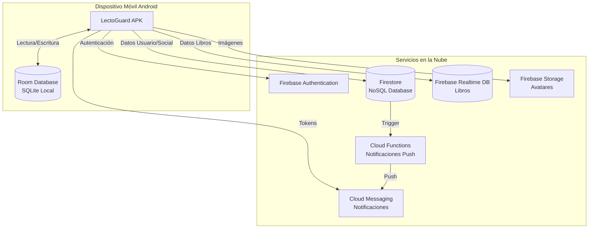
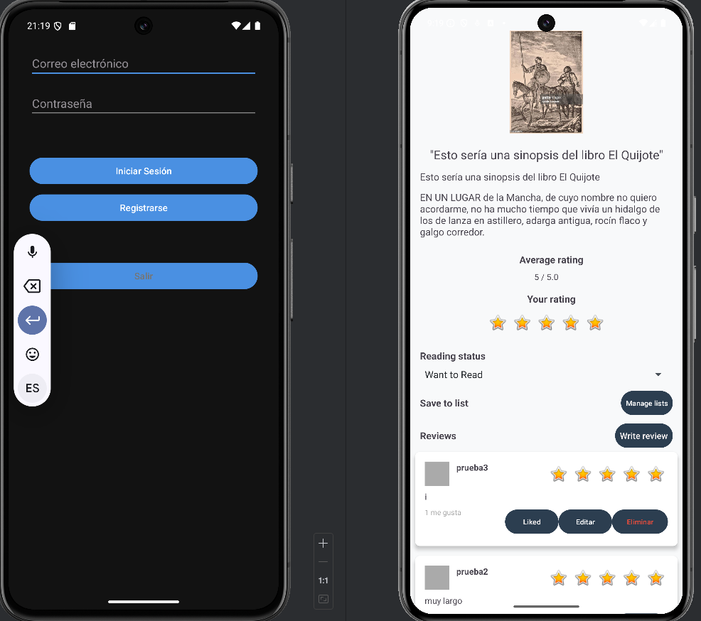
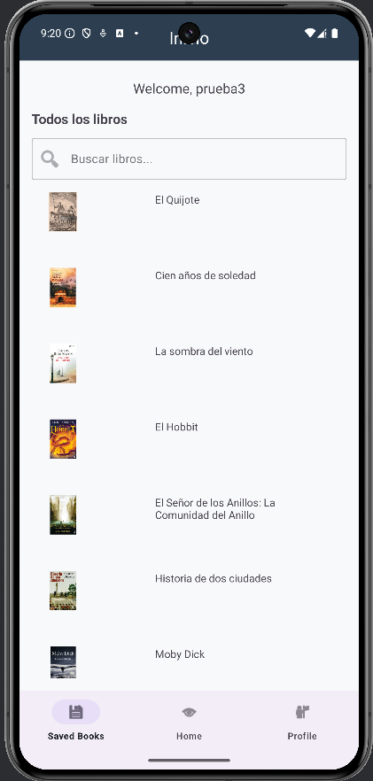
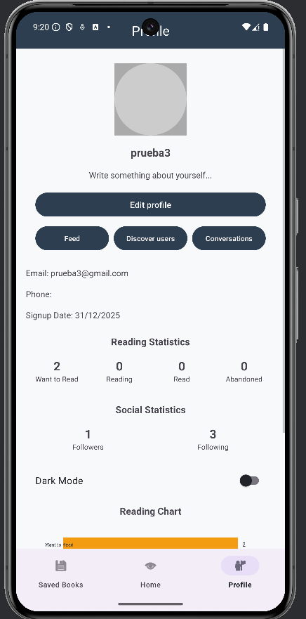
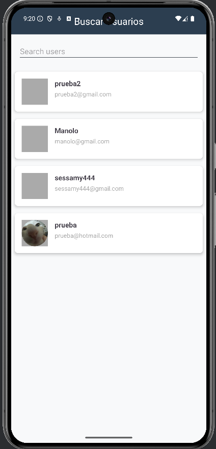
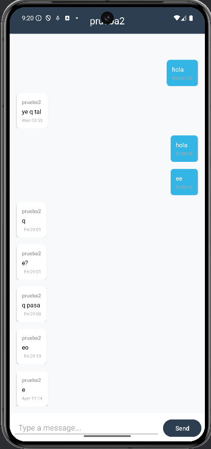
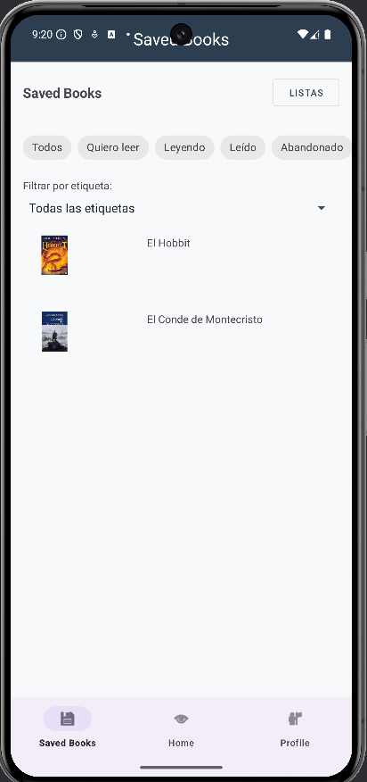
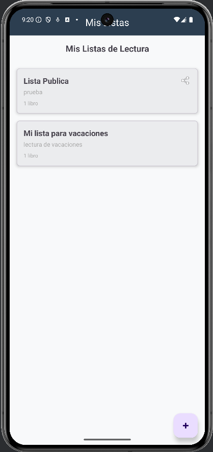

---

# IES TIERNO GALVÁN – PARLA

## LectoGuard - Plataforma Social para Amantes de la Lectura

**Proyecto fin de Ciclo Formativo**

**Autor:** Samy Mounaji Gouiss

**Fecha:** 01/01/2026

---

# Aplicación LectoGuard - Documentación

## Índice
- [Contexto de la Aplicación - Análisis](#contexto-de-la-aplicación---análisis)
- [Casos de Uso](#casos-de-uso)
- [Requisitos Funcionales y No Funcionales](#requisitos-funcionales-y-no-funcionales)
- [Diseño](#diseño)
- [Wireframes](#wireframes)
- [Arquitectura](#arquitectura)
- [Base de datos](#base-de-datos)
- [Plan de Pruebas](#plan-de-pruebas)
- [Diagrama UML](#diagrama-uml)
- [Diagrama de Despliegue](#diagrama-de-despliegue)
- [Documentación Técnica del Desarrollo](#documentación-técnica-del-desarrollo)
- [Conclusiones](#conclusiones)
- [Futuras Líneas de Investigación](#futuras-líneas-de-investigación)
- [Problemas Encontrados](#problemas-encontrados)
- [Opinión Personal](#opinión-personal)
- [Capturas de Ejecución](#capturas-de-ejecución)
- [Bibliografía](#bibliografía)

---

## Contexto de la Aplicación - Análisis

### Mundo real del problema
La aplicación resuelve la necesidad de los amantes de la lectura de tener una app para descubrir, organizar y llevar un registro de los libros que quieren leer o han leído. Muchos lectores actualmente utilizan muchas plataformas sin un sistema unificado.

### Apps existentes similares
- Goodreads
- Wattpad
- Google Play Books
- Kindle

### Por qué mi app es mejor
- Interfaz simple y minimalista
- Enfoque en la experiencia básica de guardar libros sin distracciones
- Sistema de perfil personalizado con estadísticas sencillas
- No incluye publicidad
- Totalmente gratuita
- Funciona offline/online

---

## Casos de Uso

1. **Registro de nuevo usuario**
   - Actor: Usuario no registrado
   - Flujo: Completa formulario → validación de datos → se crea la cuenta

2. **Inicio de sesión**
   - Actor: Usuario registrado
   - Flujo: Introduce credenciales → se verifican → acceso concedido

3. **Exploración de libros**
   - Actor: Usuario autenticado
   - Flujo: Navega por lista → selecciona un libro → ve detalles

4. **Guardar libro**
   - Actor: Usuario autenticado
   - Flujo: Selecciona un libro → pulsa guardar → el libro se añade a su colección (sin duplicados)

5. **Visualización de perfil**
   - Actor: Usuario autenticado
   - Flujo: Accede a perfil → ve sus estadísticas

6. **Visualización de libros guardados**
   - Actor: Usuario autenticado
   - Flujo: Accede a la lista de libros guardados → puede ver detalles

---

## Requisitos Funcionales y No Funcionales

### Funcionales:
- F1: El usuario debe poder registrarse con email, nombre, teléfono y contraseña
- F2: El usuario debe poder iniciar sesión con sus credenciales
- F3: El sistema debe mostrar una lista de libros disponibles (mock/API)
- F4: El usuario debe poder guardar libros en su colección (sin duplicados)
- F5: El sistema debe mostrar los libros guardados por el usuario
- F6: El sistema debe mostrar información del perfil del usuario
- F7: El sistema debe funcionar offline mostrando los datos guardados localmente

### No Funcionales:
- NF1: La aplicación debe responder a las acciones del usuario de forma fluida
- NF2: Los datos del usuario deben almacenarse de forma segura (Room, SharedPreferences)
- NF3: La interfaz debe ser intuitiva y accesible
- NF4: La aplicación debe funcionar en la mayoría de versiones Android
- NF5: Feedback visual claro en formularios y acciones

---

## Diseño

### GUI (Interfaz Gráfica de Usuario)

#### UI (Vistas)

**Fragmentos:**
- **HeaderFragment**: Cabecera reutilizable con el título de la pantalla

**Activities de Autenticación:**
- **LoginActivity**: Login de usuario con validación de credenciales
- **SignUpActivity**: Registro de usuario con validación de formularios

**Activities Principales:**
- **HomeActivity**: Listado de libros (API/Retrofit) con recomendaciones y búsqueda
- **SavedBooksActivity**: Libros guardados con filtros por estado y etiquetas
- **ProfileActivity**: Perfil de usuario con estadísticas y configuración
- **FeedActivity**: Feed social con actividades de usuarios seguidos
- **ConversationsListActivity**: Lista de conversaciones activas

**Activities de Gestión de Libros:**
- **SaveBookActivity**: Detalle completo de libro con valoraciones y reseñas

**Activities Sociales:**
- **SearchUsersActivity**: Búsqueda de usuarios en tiempo real
- **UserProfileActivity**: Perfil de otro usuario con opción de seguir y chatear
- **ChatActivity**: Chat individual en tiempo real

**Activities de Listas de Lectura:**
- **ReadingListsActivity**: Gestión de listas de lectura personalizadas
- **ReadingListDetailActivity**: Detalle de lista de lectura con ordenamiento
- **PublicReadingListsActivity**: Exploración de listas públicas

#### UX (Usabilidad)
- Navegación consistente con BottomNavigation
- Feedback visual inmediato (errores, confirmaciones)
- Validación de formularios en tiempo real
- Mensajes de error claros
- Diseño user friendly y colores accesibles

---

## Wireframes

A continuación se presentan los wireframes de todas las pantallas principales de la aplicación LectoGuard:

### Pantallas de Autenticación

#### LoginActivity


**Descripción**: Pantalla inicial de la aplicación donde el usuario introduce sus credenciales (email y contraseña) para iniciar sesión. Incluye enlace para registrarse si no tiene cuenta.

#### SignUpActivity


**Descripción**: Pantalla de registro donde el usuario puede crear una nueva cuenta proporcionando nombre, email, teléfono y contraseña.

### Pantallas Principales

#### HomeActivity


**Descripción**: Pantalla principal de la aplicación que muestra:
- Barra de búsqueda para buscar libros
- Sección de recomendaciones personalizadas
- Lista completa de libros disponibles con portadas, títulos y valoraciones
- Bottom Navigation para navegar entre secciones principales

#### SavedBooksActivity


**Descripción**: Pantalla que muestra todos los libros guardados por el usuario, con:
- Filtros por estado de lectura (Todos, Quiero leer, Leyendo, Leído, Abandonado)
- Lista de libros con portadas, títulos, estados y valoraciones
- Acceso rápido a detalles de cada libro

#### ProfileActivity


**Descripción**: Perfil del usuario con:
- Avatar y nombre de usuario
- Información personal (email, teléfono, fecha de registro)
- Estadísticas de lectura (libros por estado)
- Estadísticas sociales (seguidores y siguiendo)
- Gráfico circular de estadísticas de lectura
- Botones de acción: Editar perfil, Feed, Buscar usuarios, Conversaciones
- Toggle de modo oscuro
- Botón de cerrar sesión

### Pantallas de Libros

#### SaveBookActivity


**Descripción**: Detalle completo de un libro que incluye:
- Portada grande del libro
- Título
- Sinopsis del libro
- Primera pagina del libro
- Valoración promedio
- Botón para guardar en lista
- Selector de estado de lectura
- Sección de valoración personal (estrellas)
- Botón para escribir reseña
- Botón para guardar libro
- Lista de reseñas de otros usuarios con sistema de "Me gusta"

### Pantallas Sociales

#### SearchUsersActivity


**Descripción**: Pantalla de búsqueda de usuarios con:
- Campo de búsqueda en tiempo real
- Lista de usuarios encontrados mostrando avatar, nombre y email
- Acceso directo al perfil de cada usuario

#### UserProfileActivity (Perfil de Otro Usuario)


**Descripción**: Perfil de otro usuario que muestra:
- Avatar y nombre del usuario
- Bio del usuario
- Estadísticas sociales (seguidores y siguiendo)
- Botón para seguir/dejar de seguir
- Botón para enviar mensaje

#### FeedActivity


**Descripción**: Feed social que muestra:
- Actividades de usuarios seguidos (guardar libros, valorar, escribir reseñas, seguir usuarios)
- Información de la hora a la que se ha realizado cada actividad
- Acceso directo a perfiles y libros atraves de un click

### Pantallas de Chat

#### ConversationsListActivity


**Descripción**: Lista de conversaciones activas mostrando:
- Avatar del otro participante
- Nombre del usuario
- Último mensaje enviado
- Timestamp del último mensaje
- Acceso directo a cada conversación

#### ChatActivity


**Descripción**: Pantalla de chat individual con:
- Header con nombre del destinatario
- Lista de mensajes con burbujas diferenciadas (propios vs recibidos)
- Timestamp de cada mensaje
- Campo de texto para escribir mensajes
- Botón de envío

### Pantallas de Listas de Lectura

#### ReadingListsActivity


**Descripción**: Gestión de listas de lectura personalizadas con:
- Botón para crear nueva lista
- Lista de listas creadas mostrando nombre, descripción y número de libros.
- Botón de borrado para cada lista


#### ReadingListDetailActivity


**Descripción**: Detalle de una lista de lectura que muestra:
- Nombre y descripción de la lista
- Número total de libros
- Boton de borrado
- Lista de libros en la lista con portadas, títulos, autores y valoraciones
- Botón para añadir más libros
- Los libros se pueden ordenar atraves de drag and drop
  
---

## Arquitectura

- **Clean Architecture + MVVM**
- **Room** para almacenamiento local
- **Retrofit** para consumo de API REST (Firebase)
- **Repository Pattern** para desacoplar fuentes de datos
- **ViewModel** para lógica de presentación y LiveData
- **Fragments** para cabecera y navegación modular

### Componentes

#### Activities (14 Activities principales + 1 clase base)

**Autenticación:**
- **LoginActivity**: Pantalla de inicio de sesión con validación de credenciales
- **SignUpActivity**: Pantalla de registro de nuevos usuarios

**Pantallas Principales (con Bottom Navigation):**
- **HomeActivity**: Pantalla principal con listado de libros y recomendaciones
- **SavedBooksActivity**: Lista de libros guardados por el usuario con filtros por estado
- **ProfileActivity**: Perfil del usuario con estadísticas y configuración
- **FeedActivity**: Feed social con actividades de usuarios seguidos
- **ConversationsListActivity**: Lista de conversaciones activas del usuario

**Gestión de Libros:**
- **SaveBookActivity**: Detalle completo de un libro con valoraciones y reseñas

**Funcionalidades Sociales:**
- **SearchUsersActivity**: Búsqueda de usuarios en tiempo real
- **UserProfileActivity**: Perfil de otro usuario con opción de seguir y chatear
- **ChatActivity**: Pantalla de chat individual en tiempo real

**Listas de Lectura:**
- **ReadingListsActivity**: Gestión de listas de lectura personalizadas del usuario
- **ReadingListDetailActivity**: Detalle de una lista de lectura con libros y ordenamiento
- **PublicReadingListsActivity**: Exploración de listas de lectura públicas

**Clase Base:**
- **BaseActivity**: Clase base que extienden otras Activities para funcionalidades comunes (modo oscuro, etc.)

#### Fragmentos
- **HeaderFragment**: Fragmento reutilizable para mostrar el título de la pantalla actual

#### ViewModels (6 ViewModels)
- **UserViewModel**: Gestiona lógica de usuario (login, registro, perfil, seguimientos)
- **BookViewModel**: Gestiona lógica de libros (listado, guardado, detalles)
- **ReadingListViewModel**: Gestiona lógica de listas de lectura (creación, edición, ordenamiento)
- **FeedViewModel**: Gestiona lógica del feed social (carga de actividades, actualizaciones)
- **ChatViewModel**: Gestiona lógica de chat (mensajes, conversaciones, lectura)
- **RecommendationViewModel**: Gestiona lógica de recomendaciones de libros personalizadas

#### Repositorios (7 Repositorios)
- **UserRepository**: Acceso a datos de usuario (Firebase Auth, Firestore, Room)
- **BookRepository**: Acceso a datos de libros (API, Room, Firestore)
- **ReadingListRepository**: Acceso a datos de listas de lectura (Firestore, Room)
- **RatingRepository**: Acceso a datos de valoraciones y reseñas (Firestore)
- **RecommendationRepository**: Acceso a datos de recomendaciones (Firestore, cálculos de intereses)
- **FeedRepository**: Acceso a datos del feed social (Firestore)
- **ChatRepository**: Acceso a datos de chat y conversaciones (Firestore)

#### Base de datos
- **Room Database**: Entidades User, Book, UserBook, ReadingList, ReadingListBook, DAOs correspondientes
- **Firestore**: Colecciones users, books, user_books, reading_lists, conversations, messages, ratings, reviews, follows, feeds

---

## Base de datos

- **Tabla User**: id (PK), name, email, phone, password, signupDate
- **Tabla Book**: id (PK), title, coverImage
- **Tabla UserBook**: userId (FK), bookId (FK), savedDate (relación muchos a muchos)

---

## Plan de Pruebas

- **Pruebas unitarias:**
  - Validación de formularios (`ValidationUtilsTest`)
  - Lógica de negocio en ViewModel (`BookViewModelTest`)
- **Pruebas de UI:**
  - Flujo de navegación
  - Comportamiento del RecyclerView
  - Interacción con botones y feedback visual
- **Pruebas manuales:**
  - Casos de uso principales (registro, login, guardar libro, offline/online, feedback visual)

---

## Diagrama UML

```mermaid
classDiagram
    class User {
        +Int id
        +String name
        +String email
        +String phone
        +String password
        +String signupDate
    }
    class Book {
        +Int id
        +String title
        +String coverImage
    }
    class UserBook {
        +Int userId
        +Int bookId
        +String savedDate
    }
    class UserDao
    class BookDao
    class UserBookDao
    class LectoGuardDatabase
    class UserRepository
    class BookRepository
    class UserViewModel
    class BookViewModel
    class ReadingListViewModel
    class FeedViewModel
    class ChatViewModel
    class RecommendationViewModel
    class LoginActivity
    class SignUpActivity
    class HomeActivity
    class SaveBookActivity
    class ProfileActivity
    class SavedBooksActivity
    class FeedActivity
    class ConversationsListActivity
    class ChatActivity
    class SearchUsersActivity
    class UserProfileActivity
    class ReadingListsActivity
    class ReadingListDetailActivity
    class PublicReadingListsActivity
    class HeaderFragment

    UserBook *-- User : userId
    UserBook *-- Book : bookId
    LectoGuardDatabase o-- UserDao
    LectoGuardDatabase o-- BookDao
    LectoGuardDatabase o-- UserBookDao
    UserRepository -- UserDao
    BookRepository -- BookDao
    BookRepository -- UserBookDao
    UserViewModel -- UserRepository
    BookViewModel -- BookRepository
    ReadingListViewModel -- ReadingListRepository
    FeedViewModel -- FeedRepository
    ChatViewModel -- ChatRepository
    RecommendationViewModel -- RecommendationRepository
    LoginActivity -- UserViewModel
    SignUpActivity -- UserViewModel
    HomeActivity -- BookViewModel
    HomeActivity -- RecommendationViewModel
    SaveBookActivity -- BookViewModel
    ProfileActivity -- UserViewModel
    SavedBooksActivity -- BookViewModel
    FeedActivity -- FeedViewModel
    ConversationsListActivity -- ChatViewModel
    ChatActivity -- ChatViewModel
    SearchUsersActivity -- UserViewModel
    UserProfileActivity -- UserViewModel
    ReadingListsActivity -- ReadingListViewModel
    ReadingListDetailActivity -- ReadingListViewModel
    PublicReadingListsActivity -- ReadingListViewModel
    HomeActivity -- HeaderFragment
    ProfileActivity -- HeaderFragment
    SavedBooksActivity -- HeaderFragment
    FeedActivity -- HeaderFragment
    ConversationsListActivity -- HeaderFragment
```



---

## Diagrama de Despliegue



---

## Documentación Técnica del Desarrollo

## Estructura de Carpetas

```
LectoGuard/
├── app/
│   ├── src/
│   │   ├── main/
│   │   │   ├── java/es/etg/lectoguard/
│   │   │   │   ├── data/           # Room, Retrofit, repositorios
│   │   │   │   ├── domain/         # Modelos y casos de uso
│   │   │   │   ├── ui/
│   │   │   │   │   ├── view/       # Activities y Fragments
│   │   │   │   │   └── viewmodel/  # ViewModels
│   │   │   │   └── utils/          # SharedPreferences, helpers, validaciones
│   │   │   ├── res/
│   │   │   │   ├── layout/         # XMLs de Activities y Fragments
│   │   │   │   ├── drawable/       # Imágenes
│   │   │   │   └── values/         # Strings, colors, styles
│   │   │   └── AndroidManifest.xml
│   │   └── build.gradle
│   └── build.gradle
└── build.gradle
```

## Clases y Funcionalidades Principales

### 1. **Entidades y DAOs (Room)**

- **BookEntity**: Representa un libro. Cada libro tiene un id, un título y una URL de portada.
- **UserEntity**: Representa un usuario. Incluye id, nombre, email, teléfono, contraseña y fecha de registro.
- **UserBookEntity**: Relación muchos a muchos entre usuarios y libros guardados. Incluye userId, bookId y fecha de guardado.
- **UserDao, BookDao, UserBookDao**: Métodos para login, inserción, consulta de libros y relaciones.

#### Ejemplo de BookEntity:
```kotlin
/**
 * Entidad que representa un libro en la base de datos local Room.
 * @property id Identificador único del libro (clave primaria autogenerada).
 * @property title Título del libro.
 * @property coverImage URL de la portada del libro.
 */
@Entity(tableName = "book")
data class BookEntity(
    @PrimaryKey(autoGenerate = true) val id: Int = 0,
    val title: String,
    val coverImage: String
)
```

### 2. **Repositorios**

- **BookRepository**: Gestiona la lógica de acceso a libros, tanto en local (Room) como en remoto (Firebase). Incluye lógica para evitar duplicados al guardar libros y para mockear libros si la base de datos está vacía.
- **UserRepository**: Gestiona el acceso a los datos de usuario (login, registro, consulta).

#### Ejemplo de método para evitar duplicados:
```kotlin
suspend fun saveBook(userBook: UserBookEntity): Boolean {
    val existing = userBookDao.getBooksByUser(userBook.userId).any { it.bookId == userBook.bookId }
    return if (!existing) {
        userBookDao.insert(userBook)
        true
    } else {
        false
    }
}
```

### 3. **ViewModels**

- **BookViewModel**: Expone LiveData para la lista de libros, detalles, libros guardados y feedback visual. Gestiona la lógica offline/online y la integración con el repositorio.
- **UserViewModel**: Expone LiveData para el usuario, login, registro y feedback visual.

#### Ejemplo de carga de libros offline/online:
```kotlin
fun loadBooks(isOnline: Boolean) {
    viewModelScope.launch {
        val result = repository.getAllBooks(isOnline)
        books.postValue(result ?: emptyList())
    }
}
```

### 4. **Activities y Fragments**

**Activities de Autenticación:**
- **LoginActivity**: Valida el formulario de login, muestra errores con setError y Toast, y navega a Home o Registro. Maneja autenticación con Firebase Auth.
- **SignUpActivity**: Valida el formulario de registro, muestra errores y feedback visual, y registra al usuario en Firebase Auth y Room.

**Activities Principales (con Bottom Navigation):**
- **HomeActivity**: Muestra la lista de libros (API/Retrofit), recomendaciones personalizadas, búsqueda y filtros por género. Incluye HeaderFragment como cabecera y permite navegar a detalles y otras pantallas.
- **SavedBooksActivity**: Muestra los libros guardados por el usuario con filtros por estado de lectura (Quiero leer, Leyendo, Leído, Abandonado) y etiquetas. Incluye HeaderFragment.
- **ProfileActivity**: Muestra datos del usuario (email, teléfono, fecha de registro), estadísticas de lectura, estadísticas sociales (seguidores/siguiendo), gráfico circular de estadísticas, y opciones de configuración (modo oscuro, cerrar sesión). Incluye HeaderFragment.
- **FeedActivity**: Muestra el feed social con actividades de usuarios seguidos (guardar libros, valorar, escribir reseñas, seguir usuarios) en tiempo real. Incluye HeaderFragment.
- **ConversationsListActivity**: Muestra la lista de conversaciones activas del usuario con avatar, nombre del destinatario, último mensaje y timestamp. Incluye HeaderFragment.

**Activities de Gestión de Libros:**
- **SaveBookActivity**: Muestra detalles completos del libro (portada, sinopsis, primera página), permite guardar el libro, seleccionar estado de lectura, valorar con estrellas, escribir reseñas, ver reseñas de otros usuarios con sistema de "Me gusta", y guardar en listas de lectura. Soporta modo offline/online.

**Activities Sociales:**
- **SearchUsersActivity**: Permite buscar usuarios en tiempo real con campo de búsqueda, muestra lista de usuarios con avatar y nombre, y permite acceder a perfiles de otros usuarios.
- **UserProfileActivity**: Muestra perfil de otro usuario con avatar, bio, estadísticas sociales, botón para seguir/dejar de seguir, botón para enviar mensaje, y acceso a libros guardados del usuario.

**Activities de Chat:**
- **ChatActivity**: Pantalla de chat individual en tiempo real con lista de mensajes diferenciados (propios vs recibidos), timestamps, campo de texto para escribir, botón de envío, y marcado automático de mensajes como leídos.

**Activities de Listas de Lectura:**
- **ReadingListsActivity**: Gestión de listas de lectura personalizadas con botón para crear nueva lista, lista de listas creadas mostrando nombre, descripción y número de libros, y botón de borrado para cada lista.
- **ReadingListDetailActivity**: Detalle de una lista de lectura que muestra nombre y descripción, número total de libros, botón de borrado, lista de libros con portadas y títulos, botón para añadir más libros, y ordenamiento mediante drag and drop.
- **PublicReadingListsActivity**: Exploración de listas de lectura públicas de otros usuarios con búsqueda y filtros.

**Clase Base:**
- **BaseActivity**: Clase base abstracta que extienden otras Activities para funcionalidades comunes como el manejo del modo oscuro/claro y la gestión del tema de la aplicación.

**Fragments:**
- **HeaderFragment**: Fragmento reutilizable para mostrar el título de la pantalla actual de forma consistente en todas las Activities principales.

#### Ejemplo de validación en LoginActivity:
```kotlin
if (email.isEmpty()) {
    binding.etEmail.error = getString(R.string.field_required)
    valid = false
} else if (!ValidationUtils.isValidEmail(email)) {
    binding.etEmail.error = getString(R.string.invalid_email)
    valid = false
} else {
    binding.etEmail.error = null
}
```

### 5. **Utils y Helpers**

- **PrefsHelper**: Guarda y recupera la sesión del usuario con SharedPreferences.
- **NetworkUtils**: Comprueba si hay conexión a internet para decidir si se usan datos online u offline.
- **ValidationUtils**: Métodos para validar email y password, usados en formularios y pruebas unitarias.

#### Ejemplo de validación de email:
```kotlin
object ValidationUtils {
    private val EMAIL_REGEX = Regex("^[A-Za-z0-9+_.-]+@[A-Za-z0-9.-]+$")
    fun isValidEmail(email: String): Boolean =
        email.isNotEmpty() && EMAIL_REGEX.matches(email)
    fun isValidPassword(password: String): Boolean =
        password.length >= 6
}
```

### 6. **Retrofit y Firebase**

- **BookApiService**: Define los endpoints para obtener sinopsis y detalles de libros desde Firebase.
- **Integración con ScalarsConverterFactory y GsonConverterFactory** para soportar respuestas String y JSON.

#### Ejemplo de endpoint:
```kotlin
@GET("libros/{id}.json")
suspend fun getBookDetail(@Path("id") id: Int): Response<BookDetailResponse>
```

### 7. **Feedback Visual y Validación**

- Todos los formularios usan `setError` y Toasts con textos definidos en `strings.xml`.
- Feedback visual inmediato en acciones de guardado, errores y validaciones.
- Mensajes de éxito y error claros y accesibles.

### 8. **Colores y Temas**

- Gama de colores definida en `colors.xml` y aplicada en `themes.xml`.
- Botones con texto blanco para máxima accesibilidad.
- Color de acento y de cancelar diferenciados.

### 9. **Pruebas Unitarias**

- **BookViewModelTest**: Verifica la lógica de carga de libros y la integración con el repositorio.
- **ValidationUtilsTest**: Verifica la validación de email y password con diferentes casos.
- Dependencias: JUnit, MockK, kotlinx-coroutines-test, core-testing.

#### Ejemplo de test de validación:
```kotlin
@Test
fun `valid email returns true`() {
    assertTrue(ValidationUtils.isValidEmail("test@email.com"))
}
```

---

## Notas de desarrollo
- El código está preparado para ampliaciones futuras (más fragmentos, nuevas funcionalidades, etc.).
- La app está optimizada para funcionar tanto online (Firebase) como offline (Room).
- El feedback visual y la validación de formularios están implementados en todos los flujos críticos.
- El diseño sigue una gama de colores accesible y moderna.


---

## Conclusiones

El desarrollo de LectoGuard ha resultado en una aplicación móvil completa y funcional que cumple con los objetivos principales establecidos. La aplicación proporciona una solución para la gestión de bibliotecas personales de lectura, combinando funcionalidades de organización, interacción social y descubrimiento de contenido.

### Logros Principales

1. **Arquitectura Sólida**: Se ha implementado una arquitectura Clean Architecture + MVVM que facilita el mantenimiento y la escalabilidad del código. El uso de UseCases, Repositorios y ViewModels ha permitido una separación clara de responsabilidades.

2. **Funcionalidades Core Implementadas**: 
   - Sistema completo de autenticación con Firebase
   - Gestión de biblioteca personal de libros
   - Sistema social con seguimientos y perfiles
   - Chat en tiempo real entre usuarios
   - Sistema de valoraciones y reseñas
   - Listas de lectura personalizadas

3. **Experiencia de Usuario**: La interfaz es intuitiva y accesible, con navegación clara mediante Bottom Navigation y feedback visual inmediato en todas las acciones.

4. **Funcionalidad Offline**: La aplicación funciona correctamente sin conexión gracias a Room Database, mostrando datos guardados localmente cuando no hay conectividad.

5. **Calidad del Código**: Se han implementado 36 pruebas unitarias exhaustivas que cubren los UseCases críticos, garantizando la calidad y confiabilidad del código.

### Impacto del Proyecto

LectoGuard ofrece una alternativa moderna y gratuita a aplicaciones similares, enfocándose en la simplicidad y la experiencia del usuario sin distracciones publicitarias. La aplicación permite a los usuarios organizar su lectura, descubrir nuevos libros a través de recomendaciones y conectarse con otros lectores mediante el sistema social integrado.

---

## Futuras Líneas de Investigación

### 1. Mejoras en Recomendaciones
- **Análisis de Sentimiento**: Utilizar análisis de sentimiento en las reseñas para generar recomendaciones más precisas basadas en preferencias emocionales.

### 2. Optimización de Rendimiento

### 3. Funcionalidades Sociales Avanzadas
- **Grupos de Lectura**: Permitir a los usuarios crear y unirse a grupos de lectura temáticos.
- **Retos de Lectura**: Implementar sistema de retos y logros para gamificar la experiencia de lectura.
- **Eventos y Clubes de Libro**: Integrar funcionalidad para organizar eventos virtuales y clubes de lectura.

### 4. Integración con Servicios Externos
- **APIs de Libros**: Integración con APIs como Google Books o Open Library para obtener información más completa de los libros (sinopsis extendidas, información de autores, etc.).
- **Sincronización Multiplataforma**: Desarrollo de versión web o iOS para sincronización entre dispositivos.

### 5. Accesibilidad y Usabilidad
- **Modo de Lectura**: Implementar un modo de lectura integrado para leer libros directamente desde la aplicación.
- **Personalización Avanzada**: Permitir a los usuarios personalizar completamente la interfaz (temas, colores, fuentes).


---

## Problemas Encontrados

### 1. Problemas Técnicos

#### Problema: Manejo de Errores en Autenticación
**Descripción**: Inicialmente, la aplicación crasheaba cuando se introducían credenciales incorrectas en el login debido a excepciones no manejadas de Firebase Authentication.

**Solución Implementada**: Se implementó un bloque try-catch en el método `login` de `UserRepository` para capturar `FirebaseAuthException` y otras excepciones, retornando `null` en lugar de lanzar la excepción. Esto permite que la UI maneje el error de forma elegante mostrando un mensaje al usuario.

#### Problema: Scroll en ProfileActivity
**Descripción**: El usuario no podía hacer scroll en ProfileActivity, impidiendo ver el botón de cerrar sesión y otros elementos inferiores.

**Solución Implementada**: Se reestructuró el layout envolviendo todo el contenido en un `ScrollView`, manteniendo el HeaderFragment y BottomNavigation fuera del scroll para que permanezcan fijos.

#### Problema: Permisos de Firestore para Listas de Lectura
**Descripción**: Al intentar crear listas de lectura, se producía un error de permisos denegados en Firestore.

**Solución Implementada**: Se actualizaron las reglas de seguridad de Firestore para permitir que los usuarios autenticados puedan crear y gestionar sus propias listas de lectura.

### 2. Problemas de Diseño

#### Problema: Consistencia en Navegación
**Descripción**: Inicialmente, la navegación entre Activities se realizaba mediante Intents directos sin un sistema unificado.

**Solución Implementada**: Se creó `NavigationUtils` para centralizar la navegación y mantener consistencia en toda la aplicación.

### 3. Problemas de Rendimiento


#### Problema: Consultas a Firestore
**Descripción**: Las búsquedas de usuarios se ejecutaban en cada cambio de texto, generando múltiples consultas innecesarias.

**Solución Implementada**: Se implementó un delay de 500ms en la búsqueda para reducir el número de consultas y optimizar el rendimiento.

### 4. Problemas de UX

#### Problema: Feedback Visual Insuficiente
**Descripción**: Algunas acciones no proporcionaban feedback claro al usuario sobre el resultado de la operación.

**Solución Implementada**: Se implementaron Toasts y mensajes de error claros en todas las acciones críticas, además de estados de carga visuales.

#### Problema: Validación de Formularios
**Descripción**: Los formularios no validaban los datos en tiempo real, solo al enviar.

**Solución Implementada**: Se implementó validación en tiempo real con `setError` en los campos de texto y mensajes de error claros.

---

## Opinión Personal

El desarrollo de LectoGuard ha sido una experiencia de aprendizaje que me ha permitido profundizar en múltiples aspectos del desarrollo móvil Android y las tecnologías modernas de backend.

### Aspectos Positivos

1. **Arquitectura Limpia**: La implementación de Clean Architecture + MVVM ha resultado en un código muy mantenible y fácil de entender. La separación de capas (UI, Domain, Data) ha facilitado enormemente el desarrollo y las pruebas.

2. **Firebase como Backend**: Firebase ha demostrado ser una excelente elección para este proyecto, proporcionando autenticación, base de datos en tiempo real, almacenamiento y mensajería push de forma integrada y fácil de usar.

3. **Kotlin y Coroutines**: El uso de Kotlin con Coroutines ha simplificado significativamente el manejo de operaciones asíncronas y ha hecho el código más legible y menos propenso a errores.

4. **Testing**: La implementación de pruebas unitarias ha sido fundamental para detectar errores tempranamente y garantizar la calidad del código. 

### Desafíos Enfrentados

1. **Complejidad de Firestore**: Aunque Firestore es potente, la estructura de datos y las reglas de seguridad requieren planificación cuidadosa. La implementación de consultas eficientes y reglas de seguridad adecuadas fue un desafío inicial.


### Lecciones Aprendidas

1. **Planificación es Clave**: Una buena planificación inicial de la arquitectura y estructura de datos ahorra mucho tiempo durante el desarrollo.

2. **Testing Temprano**: Implementar pruebas desde el inicio del desarrollo ayuda a mantener la calidad del código y facilita la refactorización.

3. **Documentación**: Mantener documentación actualizada es esencial, especialmente cuando se trabaja con múltiples tecnologías y componentes.


### Reflexiones Finales

El proyecto ha sido especialmente valioso para aprender sobre arquitectura de software, integración con servicios en la nube, y desarrollo de aplicaciones sociales. La experiencia adquirida será fundamental para futuros proyectos de desarrollo móvil.

---

## Capturas de Ejecución

A continuación se presentan las capturas de pantalla de la aplicación LectoGuard en funcionamiento, mostrando las diferentes pantallas y funcionalidades implementadas:

### Captura 1


### Captura 2


### Captura 3


### Captura 4


### Captura 5


### Captura 6


### Captura 7


---

## Bibliografía

### Documentación Oficial y Tutoriales

1. **Android Developers - Documentación Oficial**
   - URL: https://developer.android.com/
   - Descripción: Documentación oficial de Android que cubre todos los aspectos del desarrollo de aplicaciones Android, incluyendo Activities, Fragments, ViewModels, y más.

2. **Firebase Documentation**
   - URL: https://firebase.google.com/docs
   - Descripción: Documentación completa de Firebase que incluye guías para Authentication, Firestore, Storage, Cloud Messaging y Analytics. Fundamental para entender la integración de servicios backend.

3. **Kotlin Coroutines Guide**
   - URL: https://kotlinlang.org/docs/coroutines-guide.html
   - Descripción: Guía oficial de Kotlin Coroutines que explica cómo manejar operaciones asíncronas de forma eficiente en aplicaciones Android.

4. **Room Persistence Library**
   - URL: https://developer.android.com/training/data-storage/room
   - Descripción: Documentación oficial de Room que explica cómo implementar bases de datos locales en Android, incluyendo entidades, DAOs y migraciones.

5. **Retrofit Documentation**
   - URL: https://square.github.io/retrofit/
   - Descripción: Documentación de Retrofit para realizar llamadas HTTP y consumir APIs REST. Incluye ejemplos de uso con Kotlin y Coroutines.

6. **Hilt Dependency Injection**
   - URL: https://developer.android.com/training/dependency-injection/hilt-android
   - Descripción: Guía oficial de Hilt para inyección de dependencias en Android, incluyendo configuración y mejores prácticas.

7. **Material Design Components**
   - URL: https://material.io/develop/android
   - Descripción: Documentación de Material Design Components para Android, incluyendo componentes UI y guías de diseño.

### Videos y Tutoriales

8. **Android MVVM Architecture - Coding with Mitch**
   - URL: https://www.youtube.com/watch?v=5QLKT5ikt9M
   - Descripción: Tutorial completo sobre arquitectura MVVM en Android, explicando la separación de capas y el uso de ViewModels y LiveData.

9. **Firebase Authentication Tutorial - Coding with Mitch**
   - URL: https://www.youtube.com/watch?v=1H1L8qz1bxs
   - Descripción: Tutorial práctico sobre implementación de autenticación con Firebase Authentication en aplicaciones Android.

10. **Room Database Tutorial - Coding in Flow**
    - URL: https://www.youtube.com/watch?v=Ta4aCd-vmHc
    - Descripción: Serie de videos que explican cómo implementar Room Database paso a paso, incluyendo entidades, DAOs y relaciones.

11. **Firestore Tutorial - Coding in Flow**
    - URL: https://www.youtube.com/watch?v=zr0yj2kCoqs
    - Descripción: Tutorial completo sobre Firestore que cubre lectura, escritura, consultas y listeners en tiempo real.

12. **Clean Architecture en Android - Android Developers**
    - URL: https://developer.android.com/topic/architecture
    - Descripción: Guía oficial sobre arquitectura de aplicaciones Android, incluyendo Clean Architecture y mejores prácticas.

### Artículos y Recursos Adicionales

13. **Testing Android Apps - Android Developers**
    - URL: https://developer.android.com/training/testing
    - Descripción: Guía completa sobre testing en Android, incluyendo pruebas unitarias, de integración y de UI.

14. **Glide Image Loading Library**
    - URL: https://bumptech.github.io/glide/
    - Descripción: Documentación de Glide para carga y caché eficiente de imágenes en Android.

15. **Firebase Security Rules**
    - URL: https://firebase.google.com/docs/firestore/security/get-started
    - Descripción: Guía para escribir reglas de seguridad efectivas en Firestore, fundamental para proteger los datos de los usuarios.

16. **Android Navigation Component**
    - URL: https://developer.android.com/guide/navigation
    - Descripción: Documentación del Navigation Component de Android para gestionar la navegación entre pantallas de forma declarativa.

17. **DeepSeek**
    - URL: https://chat.deepseek.com/
    - Descripción: De gran utilidad para resolver ciertos errores presentados durante el desarrollo
---

